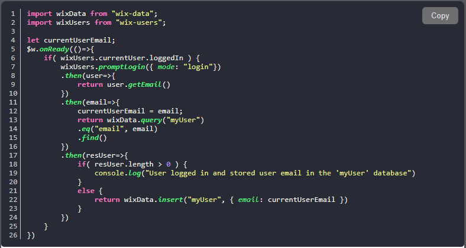

# Code snippets template
  A simple boiler plate repo to stores all the code snippets and display it as an iframe. For now just tested javascript and with Dracula theme. Update `template.html` file to change the base content of the website. Under the hood it uses highlight.js with line-number plugin and dracula theme. Use github action and update the gh-page.

## How to
1. Create a new repo 
1. Select this template during creating a new repo
1. Give Github Action permission to read and write the repo. Under **Setting > Action > Workflow Permission**
1. Re-run the workflow under the Action Tab |> To Create a branch <|
1. Enable Github Page under **Setting > Pages**
1. Select Deploy from branch
1. Under Branch select gh-page dropdown.
1. Click save
1. Goto: https://username.github.io/repo_name/sample-file.html 

## Sample



## With line highlighter


## Config
To customize the code that's in the source folder, create a file with the same name with `.config.json` ext.

sample-file.js => sample-file.config.json

```json
{
  "highlightLines": [1,2,3],
  "lineNumberStartAt": 10
}
```

> Remove the `sample-file.js` and `sample-file.config.json`

